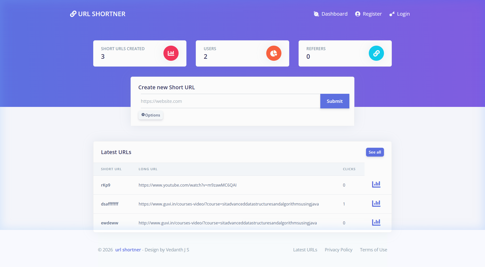
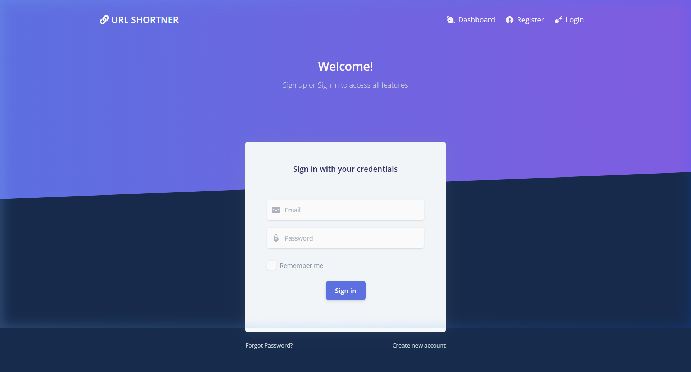

  <h1 align="center">✨ URL Shortener ✨</h1>
  

    <strong>A modern, privacy-aware, and blazing fast URL Shortener built with PHP and the Laravel Framework.</strong>
  

  
  
  
  
  

---

## 📸 Screenshots

Here is a live look at the application in action!

### Dashboard & Analytics

  

### Beautiful Login Screen

  

---

## 🚀 Features

URL Shortener provides advanced privacy-oriented options and full administrative control:

- **🔒 Privacy First**: Advanced IP hashing and anonymizing features.
- **🛡️ Admin Control**: Decide if unauthenticated users can create short URLs, block certain domains, and control user access.
- **📊 In-Depth Analytics**: Track clicks, real clicks, country visits, and HTTP referers directly from the beautiful admin panel.
- **⚡ Quick Stats**: To view a URL's analytics instantly, simply add a `+` after any Short URL!

---

## 📖 How to Use

1. **Enter the Target Website:** Paste the long URL you want to shorten into the "Create new Short URL" box on the dashboard.
2. **(Optional) Add a Custom Short URL:** If you want a specific link (e.g. `sddddddddd`), click the "Options" gear icon and enter your custom name.
3. **Copy and Use the Short Link:** Once processed, a success banner will appear at the top displaying your new shortened link (e.g., `url-shortner-bg7d.vercel.app/sddddddddd`). Share or click this generated link, and it will automatically redirect anyone who clicks it to the target website you entered!

---

## 🛠️ Installation

You can learn how to install and configure URL Shortener by following our detailed [documentation](https://urlhum.readme.io/docs/getting-started).

*Note: The application is currently under heavy development. Please test thoroughly before deploying to production environments.*

---

## 🤝 Contributing

Thank you for considering contributing to the URL Shortener project! We welcome all contributions. Feel free to send a pull request, and our maintainers will take a look at it.

If you have any questions or want to join the community, jump into our official [Telegram Group](http://t.me/urlhum).

---

## 📝 License

URL Shortener is open-source software licensed under the [MIT License](https://opensource.org/licenses/MIT).
